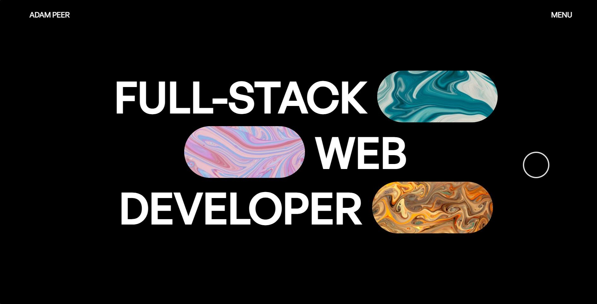

# React Portfolio

Welcome to my React portfolio project! This portfolio showcases my skills, projects, and experience as a software engineer.

## Table of Contents

- [Project Description](#project-description)
- [Features](#features)
- [Installation](#installation)
- [Usage](#usage)
- [Technologies Used](#technologies-used)
- [Folder Structure](#folder-structure)
- [Screenshots](#screenshots)

## Project Description

This is a personal website designed to highlight my expertise, projects, and professional background. It provides visitors with a comprehensive view of my skills and achievements as a software engineer.

## Features

- **Project Showcase:** Displaying a collection of my notable projects with descriptions and technologies used.
- **Skills**: Listing my technical skills in programming languages, frameworks, databases, etc
- **Contact Form:** Allowing visitors to reach out to me easily.

## Installation

To run this project locally, follow these steps:

1. Clone the repository:
   ```bash
   git clone https://github.com/adampeer/Portfolio.git
   ```

2. Navigate to the project directory:
   ```bash
   cd Portfolio
   ```

3. Install dependencies:
   ```bash
   npm install
   ```

4. Start the development server:
   ```bash
   npm run dev
   ```

## Usage

Navigate to [http://localhost:3000](http://localhost:3000) in your browser to explore the portfolio. The navigation menu will guide you through different sections.

## Technologies Used

- Vite
- React
- Styled Components
- Framer Motions

## Screenshots

